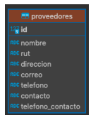
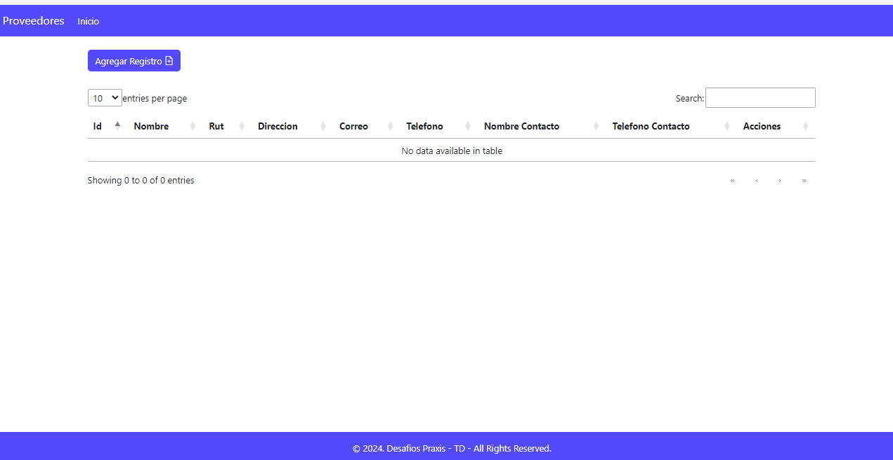
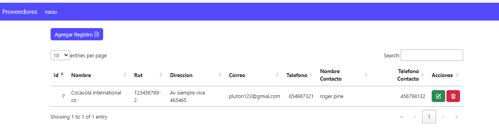
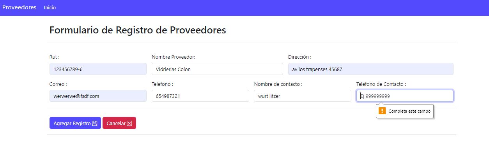
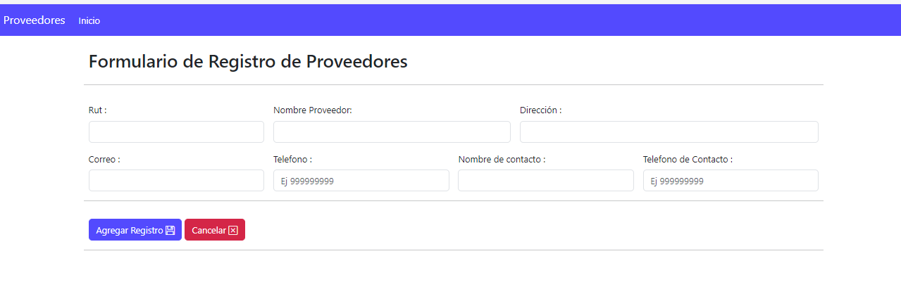
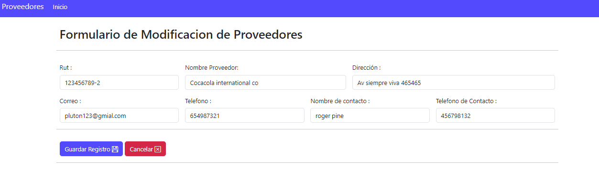
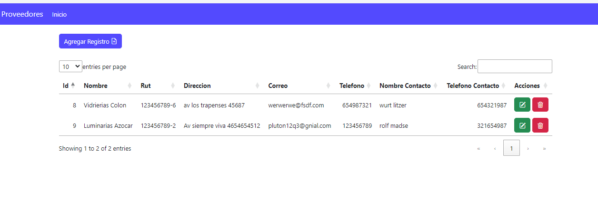

Desafío - Capa de acceso de datos (II)
-

En este desafío validaremos nuestros conocimientos para la manipulación de datos desde
una tabla en el motor de base datos postgresql.

Para lograrlo, necesitarás aplicar todo lo aprendido desde la Unidad 2 – Servlets y lo
aprendido en esta unidad: Capa acceso de datos - Métodos CRUD.

Lee todo el documento antes de comenzar el desarrollo individual, para asegurarte de tener
el máximo de puntaje y enfocar bien los esfuerzos.

Tiempo asociado: 2 horas cronológicas.

Descripción
-
Una empresa dedicada a la distribución de mercaderías para negocios de barrio está
buscando implementar un sistema web que le ayude a administrar el negocio y su control de
proveedores. Para eso, han solicitado que en esta nueva etapa, el sistema seleccione, edite y
elimine a los proveedores que abastecen a la empresa. El equipo encargado de la estructura
de la base de datos ha construido el siguiente modelo, que cumple con los requerimientos de esta primera etapa:

Al mostrar los datos de los proveedores se deben visualizar en una tabla ordenados
ascendentemente por el nombre del proveedor, mostrando todas las columnas.

<b><i>Aplicando los conceptos y herramientas aprendidas hasta ahora, generamos lo siguiente:</i></b>

1. Un proyecto Java Web Dinámico desde el IDE Eclipse.
2. Un archivo JSP de presentación para captura de valor de los datos de un proveedor.
3. Captura y validación de los parámetros enviados en el request y posterior proceso
de envío a la capa Manager.
4. Validar que la información ingresada en el formulario no sean null o vacío.

5. Implementación de una clase conexión tipo Singleton.
6. Conexión a base datos postgres por medio de driver.
7. Ejecutar query para la inserción y obtención de proveedores en clase de acceso a
datos.
8. Ejecutar query para la edición y eliminación de proveedores en clase de acceso a
datos.
9. Obtención de respuestas enviadas desde la base de datos.
10. Redireccionar a vista JSP el resultado de las operaciones CRUD o mensaje de error
en caso de no ejecutarse alguna de las acciones correctamente en la tabla.

Requerimientos
-
Mediante la utilización del IDE de desarrollo Eclipse, se debe crear un nuevo proyecto Web Dinámico llamado <b>“DesafioProveedores2”</b>, este proyecto debe ser desplegado bajo el <b>servidor Web Apache Tomcat 9 o 10.</b>

Una vez creado el proyecto, se debe crear la página “index.jsp”, la cual es el JSP de entrada,
en donde se debe visualizar el formulario con los campos a ingresar de los proveedores y
sección con tabla para mostrar todos los proveedores, adicionalmente para cada registro en
la columna llamada “acciones”, los botones con las acciones editar y eliminar.

Para la edición de un proveedor, se debe desplegar un nuevo jsp llamado “edicion.jsp” el cual mostrará todos los campos editables, a excepción del campo id y un botón para
persistir los cambios.

Se debe crear un Servlet en el cual se realiza la validación y se envía el resultado de la operación matemática.

1. Crear un nuevo proyecto Java Web Dinámico de Nombre “DesafioProveedores2” y Crear la estructura JSP correspondiente a la vista requerida, considerando el envío
de los datos hacia el Servlet haciendo uso del método POST.
 
   (2 Puntos)

2. Crear y vincular el servlet necesario para mostrar en una tabla el resultado esperado
por la operación de obtención de todos los proveedores
insertados/editados/eliminados.
   
   (2 Puntos)

3. Validar y enviar los parámetros rescatados e implementar métodos en la clase de
acceso de datos.

   (2 Puntos)

4. Acceder al “edicion.jsp” y realizar la edición y persistencia de un proveedor, acción
que debe ser gatillada desde una columna en la tabla de proveedores.

   (2 Puntos)

5. Acceder al “index.jsp” y realizar la eliminación de un proveedor, acción que debe ser
gatillada desde una columna en la tabla de proveedores, retornando a la página los
proveedores aún existentes en la tabla.

    (2 Puntos)

    
    ¡Mucho éxito!

Consideraciones y recomendaciones
-
1. Se puede apoyar de los ejercicios anteriores a modo de consulta.
2. Recuerde tener previamente configurado su servidor tomcat dentro del IDE Eclipse.
3. Debes tener el motor de base datos PostgreSQL configurado.
4. Debes recordar cómo se crea y llena una tabla en postgres.
5. Puedes utilizar como base lo realizado en la evaluación anterior (Capa de acceso de datos I).

    ¡Vamos con todo!

Imagenes del proyecto Realizado
--

Nota: me costo un poco mas dado el tiempo y la curva de aprendizaje, hay que tomarse el tiempo para realizarlo

nota se crearon mas Servlets para tenere una mejor visualizacion de como trabajar, independiente de que se puede realizar en uno o 2 solamente.

